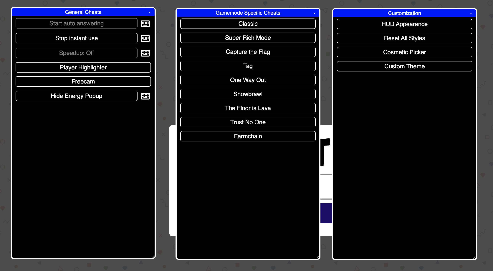
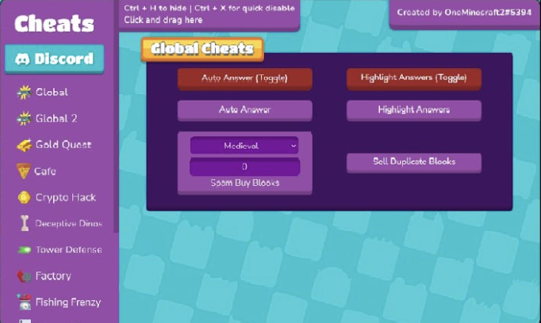

# HolyAngelsHack
This Is a Site Made for VIPs That has all the cheats you will ever need!
Status: 💚 = Working 🔴 = Not Working

# 💚GimKit💚

1. Copy the script from [here](/build/bundle.bookmarklet.txt).
2. Create a new bookmark in your browser.
3. Paste the script into the URL field.
4. Open up the Gimkit join page. **Do not join the game yet.**
5. Click the bookmark to run the script.

## Features

Hitting backslash (\\) at any point will hide the overlay. Hitting it again will cause it to reappear.

#### General

- **Auto Answer**: Automatically answers questions in all gamemodes.
- **Freecam**: Allows you to move your camera around the map freely, or spectate other players.
- **Player Highlighter**: Draws arrows pointing towards teammates/enemies, allowing you to easily find them.
- **Instant Use**: Will instantly use any interactible object rather than needing to hold down enter for a few seconds.
- **Speedup**: Lets you move faster around 1.4x faster than usual. This stacks with in-game speed upgrades.

#### Gamemode Specific

- **Auto Purchase**: Automatically purchases upgrades for you. Works for classic and similar gamemodes.
- **Super Rich Mode**: Identical to Auto Purchase, but with adjusted values for Super Rich mode.
- **Trust No One**: Shows you who the imposters are in Trust No One mode. This does not work if you join mid-game.
- **Capture the Flag**: Allows you to purchase upgrades and build walls anywhere.
- **Tag**: Allows you to purchase upgrades anywhere.
- **Snowbrawl**: Allows you to purchase medkits and shield cans anywhere.
- **One Way Out**: Allows you to purchase medkits and shield cans anywhere.
- **Farmchain**: Allows you to automatically plant seeds (assuming you have enough water and energy) and automatically harvest the plants once they grow. This will actually plant the seeds in plots that are supposed to be inaccessible until later in the game; the only thing stopping you from using them is the box on top that the script ignores. So while you might not see your plants growing, they are still being grown. Additionally, this script lets you purchase/unlock seeds anywhere.
- **The Floor is Lava**: Lets you automatically build structures when you have enough money. Also allows you to hide the "You purchased/built x" popups. Leaving this off may cause them to pile up and lag your game.

#### Cosmetic

- **Hud Customization**: The hud is easily customizable, allowing you to change the color of buttons, menus, groups and text.
- **Cosmetic Picker**: Allows you to pick any skin or trail to use. This will only be visible to you; no one else will see it. To equip a cosmetic you need to know it's internal id. This is usually listed on the [Gimkit Wiki](https://gimkit.fandom.com/wiki/Cosmetics).
- **Custom Theme**: Allows you to create a custom theme, or use any built-in theme. This works in all gamemodes, even ones that don't normally allow you to change your theme.

# 🔴Blooket🔴

# Features
### Monster Brawl
 * Double Enemy XP
 * Half Enemy Speed
 * Instant Kill
 * Invincibility
 * Kill Enemies
 * Magnet
 * Max Current Abilities
 * Next Level
 * Remove Obstacles
 * Reset Health
### Cafe
* Max Items
* Remove Customers
* Reset Abilities
* Set Cash
* Stock Food
### Crypto Hack
* Always Triple
* Auto Guess
* Choice ESP
* Password ESP
* Remove Hack
* Set Crypto
* Set Password
* Steal Players Crypto
### Deceptive Dinos
* Auto Choose
* Rock ESP
* Set Fossils
* Set Multiplier
* Stop Cheating
### Tower of Doom
* Fill Deck
* Max Cards
* Max Health
* Max Stats
* Min Enemy
* Set Coins
### Factory
* Choose Blook
* Free Upgrades
* Max Blooks
* Remove Glitches
* Send Glitch
* Set All Mega Bot
* Set Cash
### Fishing Frenzy
* Frenzy
* Remove Distraction
* Send Distraction
* Set Lure
* Set Weight
### Flappy Blook
* Set Score
* Toggle Ghost
### Global
* Anti Flood Game
* Auto Answer
* [Auto Sell Dupes On Open](cheats/global/autoSellDupesOnOpen.js)
* [Change Blook Ingame](cheats/global/changeBlookIngame.js)
* [Every Answer Correct](cheats/global/everyAnswerCorrect.js)
* [Flood Game](cheats/global/floodGame.js)
* [Get Daily Rewards](cheats/global/getDailyRewards.js)
* [Highlight Answers](cheats/global/highlightAnswers.js)
* [Prevent Suspension](cheats/global/preventSuspension.js)
* [Remove Random Name](cheats/global/removeRandomName.js)
* [Sell Cheap Duplicates](cheats/global/sellCheapDuplicates.js)
* [Sell Duplicate Blooks](cheats/global/sellDuplicateBlooks.js)
* [Simulate Pack](cheats/global/simulatePack.js.js)
* [Simulate Unlock](cheats/global/simulateUnlock.js)
* [Spam Buy Blooks](cheats/global/spamBuyBlooks.js)
* [Unlock Plus Gamemodes](cheats/global/unlockPlusGamemodes.js)
* [Use Any Blook](cheats/global/useAnyBlook.js)
#### [Intervals](cheats/global/intervals)
* [Auto Answer](cheats/global/intervals/autoAnswer.js)
* [Highlight Answers](cheats/global/intervals/highlightAnswers.js)
### [Gold Quest](cheats/gold)
* [Always Triple](cheats/gold/alwaysTriple.js)
* [Auto Choose](cheats/gold/autoChoose.js)
* [Chest ESP](cheats/gold/chestESP.js)
* [Reset All Gold](cheats/gold/resetAllGold.js)
* [Reset Players Gold](cheats/gold/resetPlayersGold.js)
* [Set Gold](cheats/gold/setGold.js)
* [Swap Gold](cheats/gold/swapGold.js)
### [Crazy Kingdom](cheats/kingdom)
* [Choice ESP](cheats/kingdom/choiceESP.js)
* [Choice ESP Loop](cheats/kingdom/choiceESPLoop.js)
* [Disable Toucan](cheats/kingdom/disableToucan.js)
* [Max Stats](cheats/kingdom/maxStats.js)
* [Set Guests](cheats/kingdom/setGuests.js)
* [Skip Guest](cheats/kingdom/skipGuest.js)
### [Racing](cheats/racing)
* [Instant Win](cheats/racing/instantWin.js)
### [Battle Royale](cheats/royale)
* [Auto Answer](cheats/royale/autoAnswer.js)
#### [Intervals](cheats/royale/intervals)
* [Auto Answer](cheats/royale/intervals/autoAnswer.js)
### [Blook Rush](cheats/rush)
* [Set Blooks](cheats/rush/setBlooks.js)
* [Set Defense](cheats/rush/setDefense.js)
### [Tower Defense](cheats/tower-defense)
* [Earthquake](cheats/tower-defense/earthquake.js)
* [Max Towers](cheats/tower-defense/maxTowers.js)
* [Remove Ducks](cheats/tower-defense/removeDucks.js)
* [Remove Enemies](cheats/tower-defense/removeEnemies.js)
* [Remove Obsticles](cheats/tower-defense/removeObsticles.js)
* [Set Damage](cheats/tower-defense/setDmg.js)
* [Set Round](cheats/tower-defense/setRound.js)
* [Set Tokens](cheats/tower-defense/setTokens.js)
### [Tower Defense 2](cheats/tower-defense-2)
* [Max Towers](cheats/tower-defense-2/maxTowers.js)
* [Remove Enemies](cheats/tower-defense-2/removeEnemies.js)
* [Set Coins](cheats/tower-defense-2/setCoins.js)
* [Set Health](cheats/tower-defense-2/setHealth.js)
* [Set Round](cheats/tower-defense-2/setRound.js)
### [Pirate's Voyage](cheats/voyage/)
* [Max Levels](cheats/voyage/maxLevels.js)
* [Set Doubloons](cheats/voyage/setDoubloons.js)
* [Start Heist](cheats/voyage/startHeist.js)
* [Swap Doubloons](cheats/voyage/swapDoubloons.js)
* [Take Doubloons](cheats/voyage/takeDoubloons.js)

